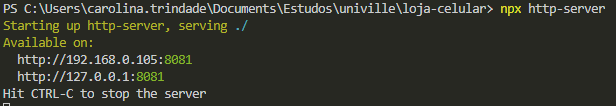

# loja-celular
O Projeto Loja de Celular é destinado à matéra de Engenharia de Software, como trabalho do 2º Bimestre.


## Instruções
Para executar e desenvolver o projeto, é necessário possuir o Nodejs (v12+) instalado.

Para executar o projeto, basta seguir os passos abaixo:

#### 1. Instalar, o pacote 'http-server'.
  É preciso executar este passo apenas uma vez.
  
  Para tanto, basta executar o comando ```npm i http-server``` em um terminal, na pasta do projeto.

#### 2. Executar a biblioteca 'http-server'
  Basta executar,  na pasta do projeto, o comando ```http-server .```
  
  Caso este comando não funcione corretamente, pode ter ocorrido algum problema para modificar as variáveis de ambiente do sistema.
  
  Portanto, caso não tenha sido possível executar o projeto utilizando o comando anterior, deve-se executar o comando ```npx http-server .```, também na pasta do projeto.

  Após executar este comando com sucesso, serão exibidas algumas informações no terminal, como na imagem abaixo:

  

#### 3. Abrir a aplicação
  Basta acessar o localhost na porta indicada ao executar o comando anterior (http://127.0.0.1:8081 ou http://localhost:8080) e será possível visualizar a aplicação.
  
  No exemplo acima, a porta 8080 já estava em uso, portanto, o server foi executado na porta 8081. Porém, certamente quando executar o comando, a porta onde o server será executado será a 8080.

### IMPORTANTE!
Através desta biblioteca será possível trabalhar com caminhos relativos através de requisições, portanto, é muito importante que o projeto seja executado desta maneira para que funcione corretamente.